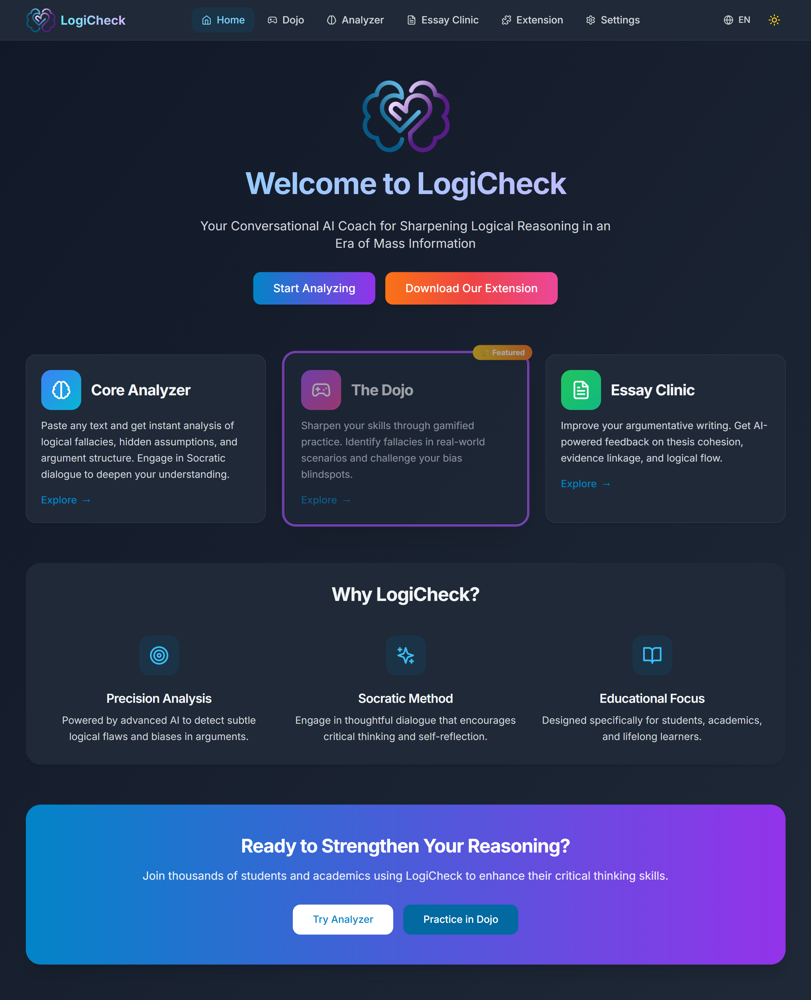
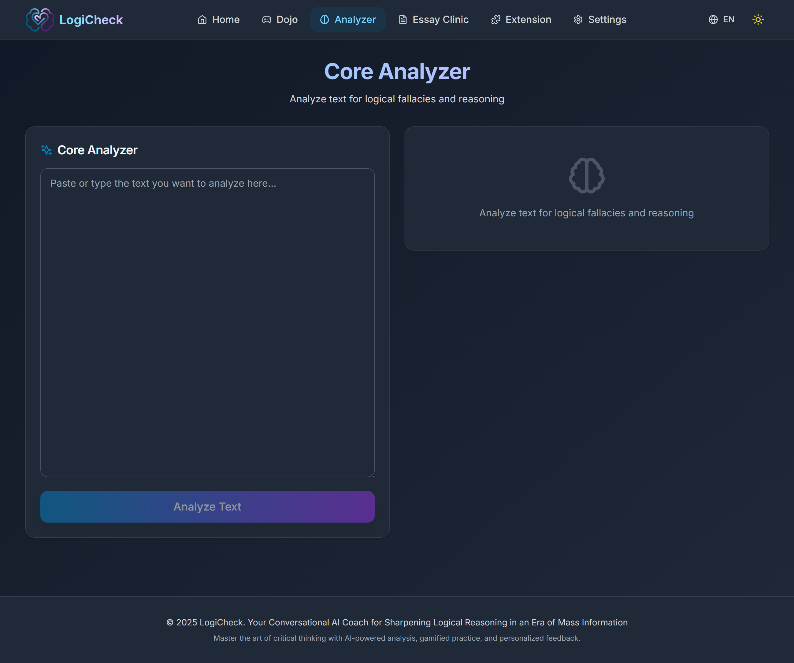
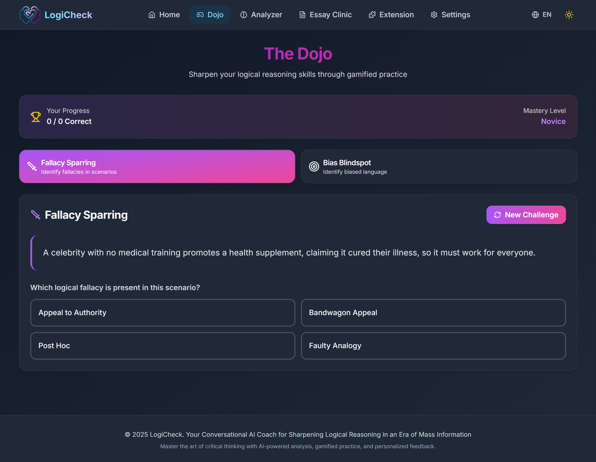
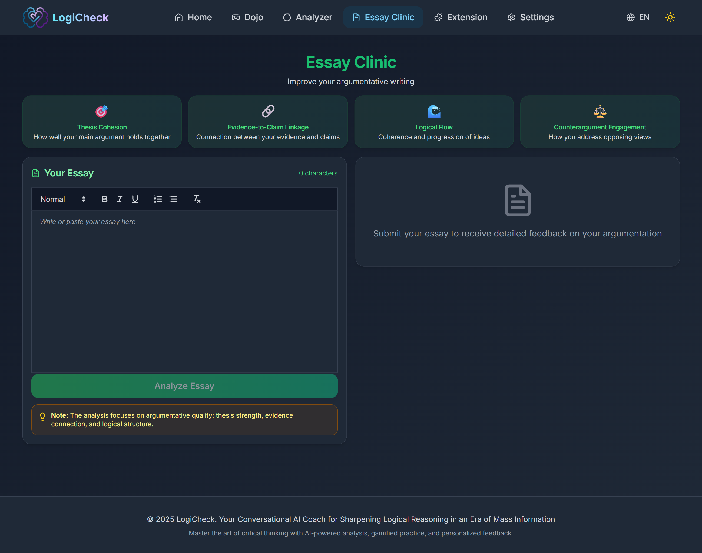
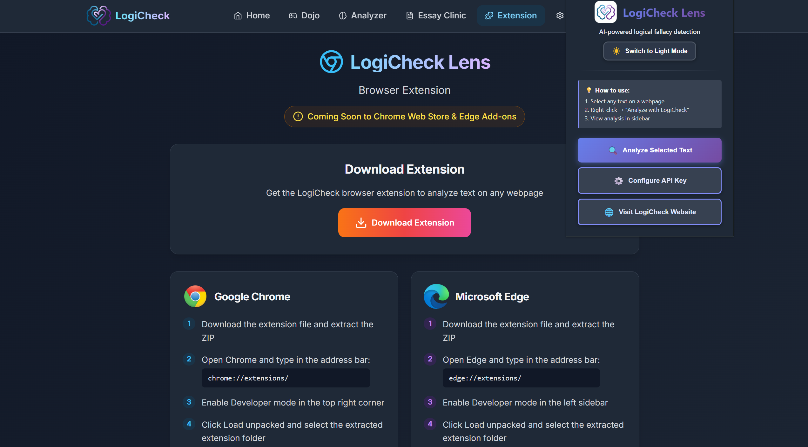
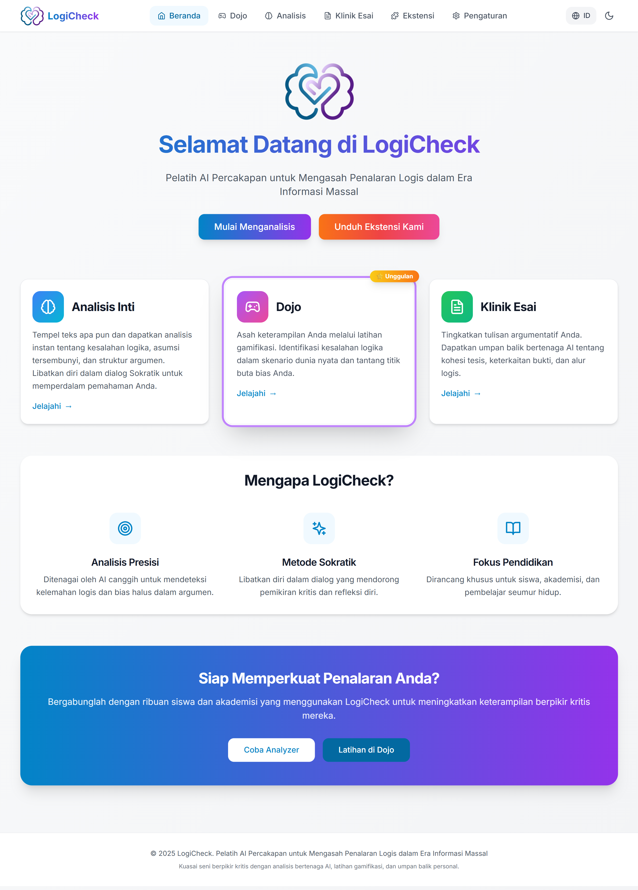
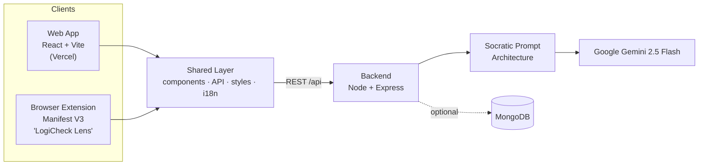

<div align="center">


# LogiCheck

**Your AI coach for sharpening logical reasoning** — spot fallacies, catch cognitive biases, and write tighter arguments.

[](https://logi-check.vercel.app/)
[](https://logi-check.vercel.app/)
[](https://react.dev)
[](https://nodejs.org)
[](https://ai.google.dev)
[](#-license)

</div>

LogiCheck is an AI-powered critical-thinking platform, available as both a **web app** and a **Chrome extension**, that helps you analyze arguments, practice identifying fallacies and biases, and improve argumentative writing. Rather than declaring claims "true" or "false," it acts as a **Socratic coach** — it surfaces the *structure* of an argument (claims, hidden assumptions, logical fallacies) and asks questions that push you to think harder.

> **Try it now:** [logi-check.vercel.app](https://logi-check.vercel.app/) — add your free Google Gemini API key in **Settings** and start analyzing. No signup required.

---

## ✨ What it does

LogiCheck is built around three modules:

### 🔍 Core Analyzer
Paste any argument or article and get a structured breakdown:
- **Main claim** — a one-sentence summary of the central argument
- **Hidden assumptions** — unstated premises the argument depends on
- **Logical fallacies** — each with the exact quote and an explanation
- **A Socratic question** — targeting the argument's weakest point, to prompt reflection (never just handing you the answer)

### 🥋 Fallacy Dojo
A gamified training ground with two game modes:
- **Fallacy Sparring** — identify the fallacy in realistic scenarios drawn from a curated 10-fallacy set (Ad Hominem, Straw Man, Slippery Slope, False Dichotomy, and more), with instant explanations.
- **Bias Blindspot** — highlight the biased passages in an article, then get AI feedback on what you caught and missed.

### ✍️ Essay Clinic
A rich-text editor that gives **argumentation-focused** feedback (not grammar/style), annotated inline across four categories:
- Thesis Cohesion
- Evidence-to-Claim Linkage
- Logical Flow
- Counterargument Engagement

### Plus, across the whole platform
- 🌐 **Dual platform** — full web app **and** a "LogiCheck Lens" browser extension that analyzes selected text on *any* webpage (right-click menu + `Ctrl/Cmd+Shift+L`).
- 🗣️ **Bilingual** — complete English 🇬🇧 and Indonesian 🇮🇩 interface *and* AI responses.
- 🌙 **Dark mode** — across web and extension.
- 🔑 **Bring Your Own Key (BYOK)** — use your own Gemini key for unlimited access; keys are stored locally in your browser, never on a server.

---

## 📸 Screenshots

> Drop your captures into a `screenshots/` folder in the repo root using the filenames below and they'll render here. Even 2–3 (Home + Analyzer + one Dojo game) tells the story well.

<table>
  <tr>
    <td width="50%"><br/><sub><b>Home</b> — landing &amp; module overview</sub></td>
    <td width="50%"><br/><sub><b>Core Analyzer</b> — claims, assumptions, fallacies + Socratic question</sub></td>
  </tr>
  <tr>
    <td><br/><sub><b>Fallacy Dojo</b> — Sparring &amp; Bias Blindspot</sub></td>
    <td><br/><sub><b>Essay Clinic</b> — inline argumentation feedback</sub></td>
  </tr>
  <tr>
    <td><br/><sub><b>LogiCheck Lens</b> — analyze text on any webpage</sub></td>
    <td><br/><sub><b>Light mode &amp; Indonesian</b> — full theming + bilingual (EN&nbsp;/&nbsp;ID)</sub></td>
  </tr>
</table>

---

## 🧠 How it works

At LogiCheck's core is a **Socratic Prompt Architecture** (`server/config/gemini.js`) — a layered prompt system that gives Gemini a consistent persona ("analytical, neutral, encouraging; never declares things true or false") and forces **strict JSON output** for each task type (`analyze`, `essay`, `sparring`, `bias`), in the user's language. The backend extracts and validates that JSON before returning it, so the UI always receives predictable, structured data.

**Model:** Google **Gemini 2.5 Flash** — chosen for fast responses (~3–10 s), a usable free tier, and strong reasoning performance. The server supports **round-robin rotation across multiple API keys** and gracefully surfaces quota (`429`) errors with guidance to switch to a personal key.



---

## 🗂️ Architecture

LogiCheck uses a **shared-component architecture** so the web app and extension stay visually and behaviorally consistent:

```
LogiCheck/
├── client/              # Web app — React 18 + Vite (deployed to Vercel)
│   └── src/
│       ├── pages/       # Home, Analyzer, Dojo, Essay Clinic, Settings, Extension
│       ├── components/  # Web components (BiasHighlighter, FallacyCard, …)
│       └── contexts/    # Analyzer / Dojo / EssayClinic / Language / Theme state
├── extension/           # Chrome extension (Manifest V3) — popup, content scripts, service worker
├── server/              # Backend API — Node.js + Express
│   ├── routes/          # analyze · dojo · clinic
│   ├── controllers/     # Request handling + Gemini calls
│   ├── config/gemini.js # Socratic Prompt Architecture (the "brain")
│   └── models/          # MongoDB schemas (optional)
├── shared/              # Code shared by web + extension (components, API, styles, i18n)
└── docs/                # Architecture, setup, and troubleshooting guides
```

---

## 🛠️ Tech Stack

| Layer | Technologies |
|-------|--------------|
| **Frontend** | React 18, Vite 5, React Router 6, Zustand (state), Axios, React Quill (editor), Lucide icons, Tailwind CSS |
| **Backend** | Node.js, Express 4, Mongoose (optional MongoDB), `@google/generative-ai` |
| **Extension** | Chrome Manifest V3 (service worker, content scripts, context menu, commands) |
| **AI** | Google Gemini 2.5 Flash |
| **Deployment** | Vercel (web) · Render/Railway (API) |

---

## 🚀 Quick Start

### Prerequisites
- **Node.js** v18+
- **Google Gemini API key** — free from [Google AI Studio](https://aistudio.google.com/app/apikey)
- **MongoDB** — *optional*, only for user-data persistence (the app runs without it)

### Install & run

```bash
# Clone
git clone https://github.com/JordanCodeGit/LogiCheck.git
cd LogiCheck

# Install root + server + client dependencies
npm run install:all

# Terminal 1 — backend  (http://localhost:5000)
npm run dev:server

# Terminal 2 — web app  (http://localhost:5173)
npm run dev:client
```

Then open **http://localhost:5173**, go to **Settings**, paste your Gemini key, hit **Test Key → Save**.

### Load the browser extension

```bash
npm run build:extension
```

1. Open `chrome://extensions/` and enable **Developer mode**.
2. **Load unpacked** → select the built `extension/dist/` folder.
3. Right-click the extension icon → **Options** → enter your Gemini key → **Save**.
4. Select text on any page → right-click **"Analyze with LogiCheck"** (or press `Ctrl/Cmd+Shift+L`).

### Environment variables (server `.env`)

```bash
GEMINI_API_KEY=your_key_here      # GEMINI_API_KEY_2..._4 also supported (round-robin)
MONGODB_URI=mongodb://localhost:27017/logicheck   # optional
FRONTEND_URL=http://localhost:5173                # optional extra CORS origin
PORT=5000
```

---

## 🔌 API Reference

Base URL: `http://localhost:5000/api` (local) — all analysis endpoints accept an optional `apiKey` in the request body (falls back to the server's rotating keys).

| Method | Endpoint | Purpose |
|--------|----------|---------|
| `POST` | `/api/analyze` | Analyze text → `mainClaim`, `assumptions`, `fallacies[]`, `socraticQuestion` |
| `GET`  | `/api/dojo/sparring-challenge` | Get a new Fallacy Sparring challenge |
| `POST` | `/api/dojo/verify-answer` | Verify a Sparring answer |
| `POST` | `/api/dojo/bias-challenge` | Get a new Bias Blindspot challenge |
| `POST` | `/api/dojo/analyze-bias-highlights` | Score the user's highlighted biased passages |
| `POST` | `/api/clinic/analyze-essay` | Annotate an essay for argumentative quality |
| `GET`  | `/api/health` | Health check |

<details>
<summary>Example — analyze text</summary>

**Request** `POST /api/analyze`
```json
{
  "text": "We shouldn't trust his research because he was fined for littering.",
  "apiKey": "optional-user-gemini-key"
}
```

**Response**
```json
{
  "mainClaim": "The researcher's work should be dismissed.",
  "assumptions": ["A person's unrelated behavior invalidates their expertise."],
  "fallacies": [
    {
      "fallacyName": "Ad Hominem",
      "quote": "he was fined for littering",
      "explanation": "Attacks the person's character instead of the research itself."
    }
  ],
  "socraticQuestion": "Does a person's unrelated conduct actually bear on the validity of their data?"
}
```
</details>

---

## 📚 Documentation

In-depth guides live in [`docs/`](docs/):
- [ARCHITECTURE.md](docs/ARCHITECTURE.md) — system design
- [SETUP_GUIDE.md](docs/SETUP_GUIDE.md) / [QUICK_START.md](docs/QUICK_START.md) — getting started
- [I18N_IMPLEMENTATION.md](docs/I18N_IMPLEMENTATION.md) — the bilingual system
- [TROUBLESHOOTING.md](docs/TROUBLESHOOTING.md) — common issues

---

## 🔒 Security & Privacy

- **User API keys are stored locally** in the browser (`localStorage`) and sent only to the backend to relay a single request to Google — they are never persisted server-side.
- **Never commit real keys.** Keep server keys in `.env` (git-ignored) and prefer environment variables in production.

---

## 👥 Authors

Built by **Team LogiCheck** — 🥇 International Gold Medal, ISIF 2025 (Education category).

- **Jordan Angkawijaya** — [LinkedIn](https://www.linkedin.com/in/jordan-angkawijaya/) · [GitHub](https://github.com/JordanCodeGit) · [Portfolio](https://jordanaw.vercel.app/)
- **Renisa Assyifa Putri** — [LinkedIn](https://www.linkedin.com/in/renisa-assyifa-putri-4ba525306/) · [GitHub](https://github.com/RedRNS)
- **Meiwildan Muhammad Farrel** — [LinkedIn](https://www.linkedin.com/in/meiwildan-muhammad-farrel/) · [GitHub](https://github.com/Meiwildan)
- **Sinta Sarwo** — [LinkedIn](https://www.linkedin.com/in/sinta-sarwo-b4a068255/) · [GitHub](https://github.com/sin32s)
- **Rafiq Al-fatiy** — [LinkedIn](https://www.linkedin.com/in/rafiq-al-fatiy-6aab57297/)
- **Monica Khirani Triastary** — [LinkedIn](https://www.linkedin.com/in/monica-khirani-triastary/) · [GitHub](https://github.com/moonformoonica)

---

## 📄 License

Released under the **ISC License**.
